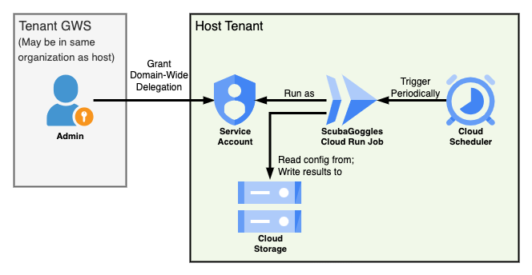

// https://docs.asciidoctor.org/asciidoc/latest/syntax-quick-reference/
= GogglesConnect: Multi-Tenant App for ScubaGoggles
:toc:
:experimental:
:title-page:

This directory includes code for automating ScubaGoggles execution in a GCP environment against one or more tenants.
Note that this document assumes knowledge of https://github.com/cisagov/ScubaGoggles/tree/main[ScubaGoggles].

== Overview
GogglesConnect consists of infrastructure deployed in a host tenant for running ScubaGoggles.
GogglesConnect is configured to automatically run ScubaGoggles against tenants on a configurable cron schedule (e.g., daily, weekly, or monthly.)
ScubaGoggles configuration files and results files are read from and written to GCP storage.

GogglesConnect can be used to run ScubaGoggles against the tenant it is deployed as well as against additional external tenants.

.GogglesConnect Architecture
--

--

== Installation

GogglesConnect requires two primary steps to install and use.

. Deploying resources to host tenant with Terraform. See <<deploy>>
. Onboarding tenants (including the tenant resources are deployed in) via Admin webpage. See <<onboard>>

=== Requirements

NOTE: It is expected that this code is deployed by a user with administrator privileges. 

. https://console.cloud.google.com/projectcreate[Create a project in GCP] for GearConnect to deploy to
. Install https://developer.hashicorp.com/terraform/install?product_intent=terraform[Terraform] on your local machine.
This is used for deploying and managing infrastructure
. Install https://docs.cloud.google.com/sdk/docs/install[gcloud CLI] on your local machine.
This is used for authenticating and interacting with your GCP environment
.. Be sure to also follow the instructions to initialize gcloud

[#deploy]
=== Deploying with Terraform

. Run `gcloud auth login` if not already done to configure your credentials
.. If you access multiple projects, run `gcloud config set project <project>`
. Prepare a directory for your deployment
.. Change directories to `gws/terraform/env`
.. Create a copy of the `example` directory with a name of your choice (e.g., `<myenv>`). **The remaining steps should be completed in this new directory**
. Update variables and configurations
.. In your new directory, `<myenv>`, modify the `variables.tfvars` file to configure the deployment for your needs
... Set `contact_emails` to administrators' emails and set `project` to the project you are deploying in
... Review the defaults used for optional variables in <<terraform-variables>>. Some of these may need to be modified depending on your environment
.. (Optional, but recommended) Modify the `provider.tf` file to configure Terraform to store state in GCP. See external https://https://developer.hashicorp.com/terraform/language/backend/gcs[documentation].
. Run terraform
.. In your `<myenv>` directory, Run `terraform init`. This only needs to be done once unless providers are updated
.. In your `<myenv>` directory, Run `terraform apply -var-file=variables.tfvars`. Confirm changes meet your expectations then type "yes"
. Onboard a tenant following the guidance in <<onboard>>

.Example of completing steps 1-3 in bash
[source,shell]
----
$ gcloud auth login
$ cd gws/terraform/env
gws/terraform/env$ cp -r example myenv
gws/terraform/env$ cd myenv
gws/terraform/env/myenv$ vim variables.tfvars
gws/terraform/env/myenv$ vim provider.tf
gws/terraform/env/myenv$ terraform init # only needed once
gws/terraform/env/myenv$ terraform apply -var-file=variables.tfvars
----

=== Setting OAuth App Name

This section will set the name of the app as it appears in Tenant admin consoles once installed.
This is important to help administrators recognize the app.

. Go to https://console.cloud.google.com/auth/branding[Google Auth Platform > Branding]
. Fill out name as "ScubaConnect"
. Fill out remaining required fields. These are only applicable for OAuth (which GogglesConnect does not use), but are required to save the name
.. Enter an email for user support
.. Leave Audience as Internal
.. Enter an email for "Contact Information"
. Select "Finish"

[#terraform-variables]
==== Terraform Variables
This section provides the description for all terraform variables sorted by their likelihood of being changed.
For a typical deployment, set `contact_emails` and `project` then review the defaults for the optional variables and override in the `tfvars` file as needed.

Required::
`project` (string) ::: Project name
`contact_emails` (list(string)) ::: Email addresses to notify of any failures
Optional::
`region` (string) [default=us-east4]::: The region resources should be deployed in
`cron_schedule` (string) [default=0 0 * * 0]::: Cron schedule defining when to run scuba runner. Format is standard cron syntax
`tenants_dir_path` (string) [default=./tenants]::: Relative path to directory containing tenant configuration files in yaml
Advanced::
`container_image` (string) [default=ghcr.io/cisagov/scubaconnect-gws:latest]::: Docker image to use for running ScubaGoggles. Must be hosted in GitHub
`container_memory_gb` (number) [default=1]::: Number of GB of memory to allocate for the container
`output_all_files` (bool) [default=False]::: If true, will output all files generated by ScubaGoggles instead of just the ScubaResults.json
`input_bucket` (string) [default=None]::: Pre-existing bucket name to read tenant config files from containing `adhoc` and `scheduled` directories. If null, will create a bucket and upload local files
`output_bucket` (string) [default=None]::: Pre-existing bucket name to output results to. If empty, will create a bucket

[#onboard]
=== Onboarding a Tenant

These instructions require a super admin for the organization.

. Go to "https://admin.google.com > Security > Access and data control > API controls"
. Select "MANAGE DOMAIN WIDE DELEGATION" then "Add new"
. For the "Client ID" paste the Terraform output `scuba_runner_svc_acct_id`.
. For the "OAuth scopes" paste the Terraform output `oauth_scopes` (you can paste the comma separate list into one line and the webpage will parse on submission)
. Select "AUTHORIZE"

Once completed, upload a ScubaGoggles configuration file to the `input_storage_bucket` named `<tenant_fqdn>.yaml` (e.g., `example.com.yaml`).
You may upload the file directly to GCS, or place it in `env/<your_env>/tenants/` and run `terraform apply`.
Refer to the https://github.com/cisagov/ScubaGoggles/blob/main/scubagoggles/sample-config-files/scuba_compliance.yaml[ScubaGoggles Configuration File documentation] for details on creating the configuration file (**be sure to uncomment lines for `subjectemail` and `customerid`**).

Repeat these steps for each tenant in a multi-tenant architecture.

=== Logging / Alerts

Execution logs from the container are written to GCP and can be viewed in https://console.cloud.google.com/logs[Logs Explorer] or by looking at https://console.cloud.google.com/run/jobs[individual job results].
The job will fail if ScubaGoggles failed to run on any tenant.
An alert is created to email users when a log is of level `ERROR` or higher.

=== Maintenance

The docker container will be regularly rebuilt and updated overtime to support new versions of ScubaGoggles.
No action is required for container updates as the Container Registry will grab the latest image by default.

== Frequently Asked Questions

How does a tenant offboard from ScubaConnect?::
An admin may offboard their tenant from the Admin page by deleting the application.
This can be done by going to Go to "https://admin.google.com > Security > Access and data control > API controls > DOMAIN WIDE DELEGATION" and deleting the app.
At this point, the application no longer has permissions to run.
Additionally, an admin for ScubaConnect should delete the configuration file from the input bucket to prevent future run attempts on the tenant.
