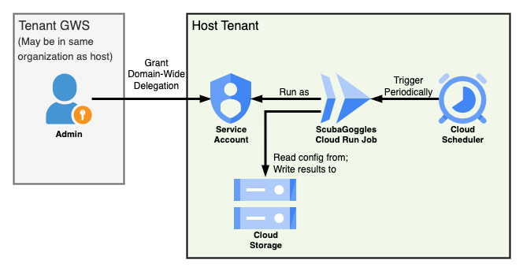

// https://docs.asciidoctor.org/asciidoc/latest/syntax-quick-reference/
= GogglesConnect: Multi-Tenant App for ScubaGoggles
:toc:
:experimental:
:title-page:

This directory includes code for automating ScubaGoggles execution in a GCP environment against one or more tenants.
Note that this document assumes knowledge of https://github.com/cisagov/ScubaGoggles/tree/main[ScubaGoggles].

== Overview
GogglesConnect consists of infrastructure deployed in a host tenant for running ScubaGoggles.
GogglesConnect is configured to automatically run ScubaGoggles against tenants on a configurable cron schedule (e.g., daily, weekly, or monthly.)
ScubaGoggles configuration files and results files are read from and written to GCP storage.

GogglesConnect can be used to run ScubaGoggles against the tenant it is deployed as well as against additional external tenants.

.GogglesConnect Architecture
--

--

== Installation

GogglesConnect requires two primary steps to install and use.

. Deploying resources to host tenant with Terraform. See <<deploy>>
. Onboarding tenants (including the tenant resources are deployed in) via Admin webpage. See <<onboard>>

=== Requirements

NOTE: It is expected that this code is deployed by a user with administrator privileges. 

. https://console.cloud.google.com/projectcreate[Create a project in GCP] for GearConnect to deploy to
. Install https://developer.hashicorp.com/terraform/install?product_intent=terraform[Terraform] on your local machine.
This is used for deploying and managing infrastructure
. Install https://docs.cloud.google.com/sdk/docs/install[gcloud CLI] on your local machine.
This is used for authenticating and interacting with your GCP environment
.. Be sure to also follow the instructions to initialize gcloud

[#deploy]
=== Deploying with Terraform

==== Terraform Basics

. **Authenticate with GCP**
.. Run `gcloud auth login` if not already done to configure your credentials
.. If you access multiple projects, run `gcloud config set project <project>` to set your active project

. **Create your deployment directory**
.. Create a new directory anywhere on your machine for your Terraform configuration
.. Copy the example files from `gws/example_deployment/` as a starting template

. **Configure your deployment**
.. Edit `provider.tf` and set:
... `project` — your GCP project ID (replace the TODO)
... `region` — your preferred region (default is `us-east4`)
.. Edit `main.tf` and set:
... `contact_emails` — list of email addresses to notify on failures (replace the TODO)
... `source` ref — pin to the latest release tag from the https://github.com/cisagov/ScubaConnect/releases[Releases page] (replace `vX.Y.Z`)
.. Review optional module inputs commented out in `main.tf`. To override any, uncomment and modify. See <<terraform-variables>> for the full reference.
.. (Optional) Create a `tenants/` directory (already present in the example) and add tenant configuration YAML files (see <<onboard>>). If you skip this, you can upload tenant configs directly to GCS later.
.. (Optional, but recommended) Uncomment and configure the `backend "gcs"` block in `provider.tf` to store Terraform state remotely. See https://developer.hashicorp.com/terraform/language/backend/gcs[Terraform GCS backend documentation].

. **Deploy the infrastructure**
.. Run `terraform init` in your deployment directory (only needed once, or when providers are updated)
.. Run `terraform apply` and review the planned changes
.. Type "yes" to confirm and deploy

. **Note the Terraform outputs** — you'll need `scuba_runner_svc_acct_id` and `scuba_runner_svc_acct_email` for onboarding tenants

. **Onboard a tenant** following the guidance in <<onboard>>

TIP: Always pin the module `ref` parameter to a specific release tag (e.g., `?ref=v2.1.0`) for reproducibility. Check the https://github.com/cisagov/ScubaConnect/releases[Releases page] for the latest version.

.Example deployment workflow
[source,shell]
----
# Authenticate
$ gcloud auth login
$ gcloud config set project my-gcp-project

# Set up deployment directory
$ cp -r path/to/ScubaConnect/gws/example_deployment my-goggles-deployment
$ cd my-goggles-deployment

# Configure
$ vim provider.tf  # Set project and region
$ vim main.tf      # Set contact_emails and pin module ref to latest release tag
# Optional: add tenant YAML files to tenants/ directory

# Deploy
$ terraform init
$ terraform apply

# Save outputs for onboarding
$ terraform output scuba_runner_svc_acct_id
$ terraform output scuba_runner_svc_acct_email
----

=== Setting OAuth App Name

This section will set the name of the app as it appears in Tenant admin consoles once installed.
This is important to help administrators recognize the app.

. Go to https://console.cloud.google.com/auth/branding[Google Auth Platform > Branding]
. Fill out name as "ScubaConnect"
. Fill out remaining required fields. These are only applicable for OAuth (which GogglesConnect does not use), but are required to save the name
.. Enter an email for user support
.. Leave Audience as Internal
.. Enter an email for "Contact Information"
. Select "Finish"

[#terraform-variables]
==== Terraform Variables

This section provides the description for all module variables. For a typical deployment, you only need to set `contact_emails` in `main.tf`. To override any optional variables, uncomment and modify them in the `module` block in `main.tf`.

Module Inputs (set in `main.tf` module block)::
`contact_emails` (list(string), **required**) ::: Email addresses to notify of any failures
`cron_schedule` (string) [default=0 0 * * 0]::: Cron schedule defining when to run scuba runner. Format is standard cron syntax (default: weekly Sunday at midnight)
`tenants_dir_path` (string) [default=null]::: Path to a directory of tenant *.yaml config files, relative to your Terraform root directory. If unset or the directory is empty, no tenant files are uploaded (you can upload them directly to GCS instead).
`container_image` (string) [default=ghcr.io/cisagov/scubaconnect-gws:latest]::: Docker image to use for running ScubaGoggles. Must be hosted in GitHub
`container_memory_gb` (number) [default=1]::: Number of GB of memory to allocate for the container
`output_all_files` (bool) [default=false]::: If true, will output all files generated by ScubaGoggles instead of just the ScubaResults.json
`input_bucket` (string) [default=null]::: Pre-existing bucket name to read tenant config files from containing `adhoc` and `scheduled` directories. If null, will create a bucket and upload local files
`create_output_bucket` (bool) [default=true]::: If true, will create a local storage bucket and write results there. Results can be written to additional buckets via extra_output_buckets.
`extra_output_buckets` (list(string)) [default=[]]::: Extra output bucket names to write results to. The service account must be granted roles/storage.objectCreator.

Provider Configuration (set in `provider.tf`)::
`project` (string, **required**) ::: Your GCP project ID
`region` (string) [default in example=us-east4]::: The region resources should be deployed in

[#onboard]
=== Onboarding a Tenant

==== Tenant

Create a ScubaGoggles configuration file for the tenant following the https://github.com/cisagov/ScubaGoggles/blob/main/scubagoggles/sample-config-files/scuba_compliance.yaml[ScubaGoggles Configuration File documentation].
**Be sure to uncomment and fill out the lines for `subjectemail` and `customerid`.**
Name the file `<tenant_fqdn>.yaml` (e.g., `example.com.yaml`).

These instructions require a super admin for the organization::
. Grant Domain-wide Delegation
.. Go to "https://admin.google.com > Security > Access and data control > API controls"
.. Click btn:[MANAGE DOMAIN WIDE DELEGATION] then btn:[Add new]
.. For the "Client ID" paste the Terraform output `scuba_runner_svc_acct_id`.
.. For the "OAuth scopes" paste the Terraform output `oauth_scopes` (you can paste the comma-separated list into one line and the webpage will parse on submission). These scopes originate from the https://github.com/cisagov/ScubaGoggles/blob/main/docs/authentication/ServiceAccount.md[ScubaGoggles Service Account documentation] and should be kept in sync with ScubaGoggles requirements.
.. Select "AUTHORIZE"
. Grant Group Reader role
.. Go to "https://admin.google.com > Account > Admin Roles"
.. Locate the "Groups Reader" role and click "Actions > Assign Admins"
.. Click on btn:[Assign service accounts]
.. Paste the Terraform output `scuba_runner_svc_acct_email` for the service account email address and click btn:[ADD]
.. Under Set Conditions, ensure that "Access to all groups" is selected and click btn:[ASSIGN ROLE]
. Grant Custom License Read Role
.. Go to "https://admin.google.com > Account > Admin Roles"
.. Click btn:[Create new role]
.. Enter a name such as "License Read" and select btn:[CONTINUE]
.. Under Admin Privileges search for "license" and select "License Read". Click btn:[CONTINUE] then btn:[CREATE ROLE]
.. Click on btn:[Assign service accounts]
.. Paste the Terraform output `scuba_runner_svc_acct_email` for the service account email address, click btn:[ADD], and click btn:[ASSIGN ROLE]

[.small]
Onboarding instructions adapted from https://github.com/cisagov/ScubaGoggles/blob/main/docs/authentication/ServiceAccount.md[ScubaGoggles - Using a Service Account].

==== GogglesConnect Host

Upload the tenant's ScubaGoggles configuration file to the `input_storage_bucket` bucket in the `adhoc` and/or `scheduled` folder. 
(See <<adhoc-v-scheduled,the FAQ>> for an explanation on the folders.)
You may upload the file directly to GCS, or place it in your local `tenants/` directory (if configured via `tenants_dir_path`) and run `terraform apply` to upload to both folders.

=== Logging / Alerts

Execution logs from the container are written to GCP and can be viewed in https://console.cloud.google.com/logs[Logs Explorer] or by looking at https://console.cloud.google.com/run/jobs[individual job results].
The job will fail if ScubaGoggles failed to run on any tenant.
An alert is created to email users when a log is of level `ERROR` or higher.

=== Maintenance

The docker container will be regularly rebuilt and updated overtime to support new versions of ScubaGoggles.
No action is required for container updates as the Container Registry will grab the latest image by default.

== Frequently Asked Questions

How does a tenant offboard from ScubaConnect?::
An admin may offboard their tenant from the Admin page by deleting the application.
This can be done by going to Go to "https://admin.google.com > Security > Access and data control > API controls > DOMAIN WIDE DELEGATION" and deleting the app.
At this point, the application no longer has permissions to run.
Additionally, an admin for ScubaConnect should delete the configuration file from the input bucket to prevent future run attempts on the tenant.

[#adhoc-v-scheduled]
What are the input `adhoc` and `scheduled` folders for?::
These folders are used to distinguish regularly scheduled runs from one-off tests.
When you start the `gogglesconnect-runner` Cloud Run Job directly, it will run on each tenant in the `adhoc` folder.
When the runner is started via Cloud Scheduler, it will use the `scheduled` folder.
The ScubaResults json file will contain a `RunType` key in the `MetaData`` section stating whether the run was adhoc or scheduled.
+
A common use case for these folders is to upload a new configuration file to `adhoc`, manually run `gogglesconnect-runner` then move the configuration file to `scheduled` after you have verified the adhoc run worked.
