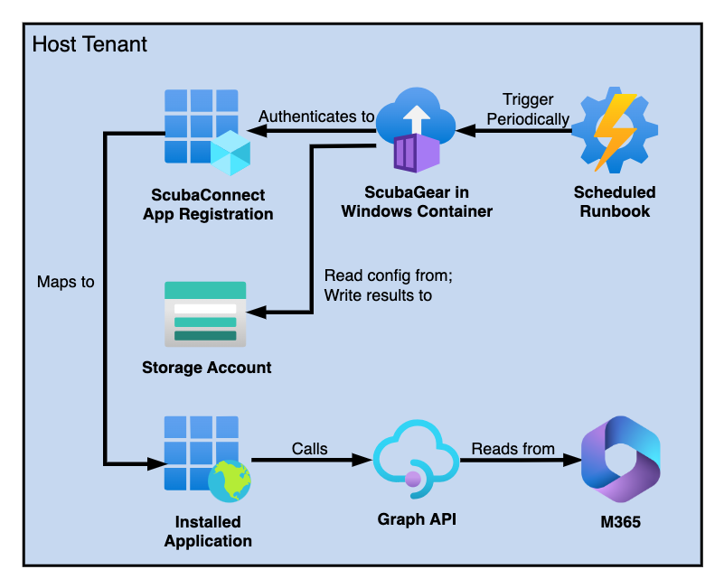

// https://docs.asciidoctor.org/asciidoc/latest/syntax-quick-reference/
= GearConnect: Multi-Tenant App for ScubaGear
:toc:
:experimental:
:title-page:

This directory includes code for automating ScubaGear execution in an Azure environment against one or more tenants.
Note that this document assumes knowledge of https://github.com/cisagov/ScubaGear/tree/main[ScubaGear].

== Overview
GearConnect consists of infrastructure deployed in a host tenant for running ScubaGear and an installation script used by tenants to install the ScubaConnect application.
GearConnect is configured to automatically run ScubaGear against tenants on configurable schedule (e.g., daily, weekly, or monthly.)
ScubaGear configuration files and results files are read from and written to Azure storage.

GearConnect can be used to run ScubaGear against the tenant it is deployed in or it can be used in a multi-tenant setting to run ScubaGear against multiple other tenants.

.GearConnect Single-Tenant Architecture

.GearConnect Multi-Tenant Architecture
image::../docs/diagrams-m365.png[width=1000]

== Installation

=== Requirements

Before deploying GearConnect, the following will need to be installed on your machine:

* https://developer.hashicorp.com/terraform/install?product_intent=terraform[Terraform] - Used for deploying and managing infrastructure
* https://learn.microsoft.com/en-us/cli/azure/get-started-with-azure-cli[Azure CLI] - Used for authenticating and interacting with your Azure environment
** Be sure to also follow the instructions to sign in

=== Deploying with Terraform

. Clone or download this repository
. Change directories to `m365/terraform/env`
. Create a copy of the `example` directory with a name of your choice
. Modify the `.tfvars` file to configure the deployment for your needs. See <<_terraform_variables>> for configuration options
.. Optionally modify `provider.tf` to configure Terraform to store state in Azure. See external https://developer.hashicorp.com/terraform/language/backend/azurerm[documentation].
. Run `terraform apply -var-file=<myfile>.tfvars`. Confirm changes meet your expectations then type "yes"

==== Terraform Variables

=== Onboarding a Tenant

=== Maintenance

== Troubleshooting

== Additional Code Information