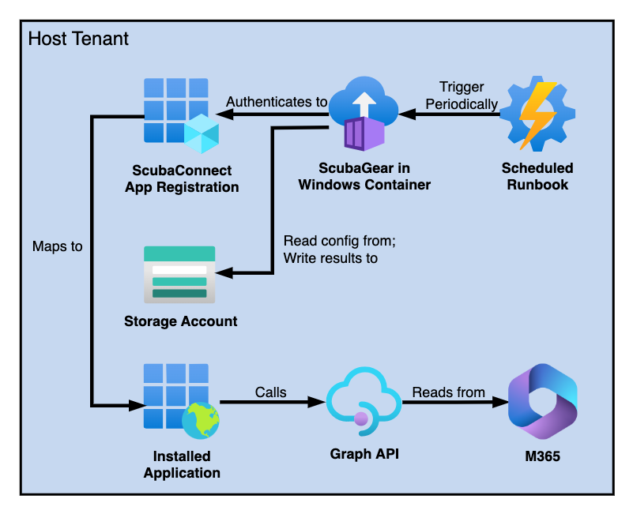
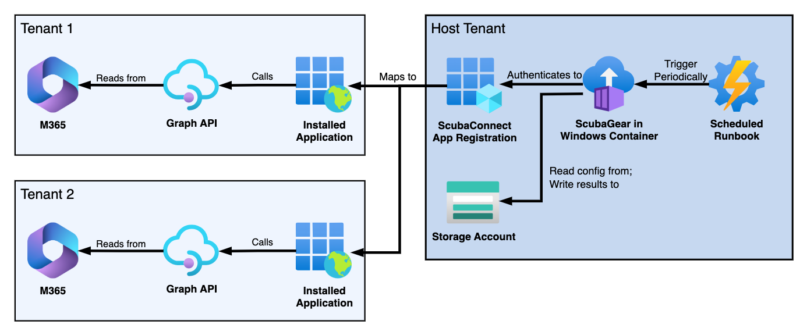

// https://docs.asciidoctor.org/asciidoc/latest/syntax-quick-reference/
= GearConnect: Multi-Tenant App for ScubaGear
:toc:
:experimental:
:title-page:

This directory includes code for automating ScubaGear execution in an Azure environment against one or more tenants.
Note that this document assumes knowledge of https://github.com/cisagov/ScubaGear/tree/main[ScubaGear].

== Overview
GearConnect consists of infrastructure deployed in a host tenant for running ScubaGear and an installation script used by tenants to install the ScubaConnect application.
GearConnect is configured to automatically run ScubaGear against tenants on configurable schedule (e.g., daily, weekly, or monthly.)
ScubaGear configuration files and results files are read from and written to Azure storage.

GearConnect can be used to run ScubaGear against the tenant it is deployed in or it can be used in a multi-tenant setting to run ScubaGear against multiple other tenants.

NOTE: GCC High environments are separated from commercial and GCC. Deploy GearConnect in the same environment as the tenants you intend to run on. (Commercial and GCC can communicate between each other.)

.GearConnect Single-Tenant Architecture
--

--

.GearConnect Multi-Tenant Architecture
--

--

== Installation

GearConnect requires two primary steps to install and use.

. Deploying resources to host tenant with terraform. See <<deploy>>
. Onboarding tenants via uploading configuration files and running install script. See <<onboard>>

=== Requirements

Before deploying GearConnect, the following will need to be installed on your machine:

* https://developer.hashicorp.com/terraform/install?product_intent=terraform[Terraform] - Used for deploying and managing infrastructure
* https://learn.microsoft.com/en-us/cli/azure/get-started-with-azure-cli[Azure CLI] - Used for authenticating and interacting with your Azure environment
** Be sure to also follow the instructions to sign in

It is expected that this code is deployed by a user with administrator privledges. 

[#deploy]
=== Deploying with Terraform

. **Authenticate to Azure**
.. Run `az login` to configure your credentials

. **Set up your deployment directory**
.. Copy the example files from `m365/example_deployment/` as a starting template
.. This will be your working directory where you customize and run Terraform

. **Configure your deployment**
.. Edit `provider.tf` and set:
... `subscription_id` — your Azure Subscription ID (find with `az account show`)
... `environment` — use `"public"` for commercial/GCC, or `"usgovernment"` for GCC High (set in both provider blocks)
.. Edit `main.tf` and set:
... `contact_emails` — list of email addresses to notify on failures and certificate expiry
... `resource_group_name` — name of the resource group to create
... `source` — set the final part to the latest release tag from the https://github.com/cisagov/ScubaConnect/releases[Releases page] (replace `X.Y.Z`)
.. (Optional) Create a `tenants/` directory (already present in the example) and add tenant configuration YAML files (see <<onboard>>). If you skip this, you can upload tenant configs directly to Azure Storage later.
.. Review optional module inputs listed at <<terraform-variables>>. To set any, add them to the block in `main.tf` below the existing variables.
.. (Optional, but recommended) Uncomment and configure the `backend "azurerm"` block in `provider.tf` to store Terraform state remotely. See https://developer.hashicorp.com/terraform/language/backend/azurerm[Terraform backend documentation].

. **Deploy the infrastructure**
.. Run `terraform init` in your deployment directory (only needed once, or when providers are updated)
.. Run `terraform apply` and review the planned changes
.. Type "yes" to confirm and deploy

. **Note the Terraform outputs** — you'll need `app_id` for onboarding tenants

. **Onboard a tenant** following the guidance in <<onboard>>

TIP: Always pin the module `ref` parameter to a specific release tag (e.g., `?ref=v2.1.0`) for reproducibility. Check the https://github.com/cisagov/ScubaConnect/releases[Releases page] for the latest version.

.Example deployment workflow
[source,shell]
----
# Authenticate
$ az login

# Set up deployment directory
$ cp -r path/to/ScubaConnect/m365/example_deployment my-gearconnect-deployment
$ cd my-gearconnect-deployment

# Edit main.tf and provider.tf files in preferred editor

# Deploy
$ terraform init
$ terraform apply
----

[#terraform-variables]
==== Terraform Variables

This section documents the module's input variables (set in `main.tf`).
Provider configuration (project ID, region, credentials) is set separately in `provider.tf`.

Required::
`contact_emails` (list(string)) ::: Email addresses to notify for alerts and before certificate expiry
`resource_group_name` (string) ::: Resource group name to create and build resources in
Optional::
`location` (string) [default=East US]::: Azure region to build resources in
`schedule_interval` (string) [default=Week]::: The interval to run the scheduled job on
`app_name` (string) [default=ScubaConnect]::: App name. Displayed in Azure console on installed tenants
`app_multi_tenant` (bool) [default=False]::: If true, the app will be able to be installed in multiple tenants. By default, it is only available in this tenant
`vnet` (object) [default=None]::: Configuration for the vnet, including the address space, ACI subnet, and a list of allowed IP ranges. All strings in CIDR format
`firewall` (object) [default=None]::: Configuration for an Azure Firewall; if not null, traffic will be routed through this firewall
`tags` (map(string)) [default={}]::: Tags to apply to all resources created. Application is done via policies
`serial_number` (string) [default=01]::: Increment by 1 when re-provisioning with the same resource group name
`image_path` (string) [default=null]::: Path to custom image for app logo. If null (default), uses the bundled CISA logo. Displayed in Azure console on installed tenants
`output_all_files` (bool) [default=False]::: If true, will output all files generated by ScubaGear instead of just the ScubaResults.json
`prefix_override` (string) [default=None]::: Prefix for resource names. If null, one will be generated from app_name
Advanced::
`create_app` (bool) [default=True]::: If true, the app will be created. If false, the app will be imported
`input_storage_container_url` (string) [default=None]::: If not null, input container to read configs from (must assign blob reader role role to service account `sp_object_id` manually).
Otherwise by default will create storage container. 
Expect a container URL like: https://<account>.blob.core.windows.net/<container>
Note that the container must have "adhoc" and "scheduled" directories. These are not created automatically in this case
`create_output_storage` (bool) [default=True]::: If true, will create a local storage container and write results there. 
Results can be written to additional buckets via extra_output_container_urls
`extra_output_container_urls` (list(string)) [default=[]]::: Extra output container URLs to write results to. URL format: https://<account>.blob.core.windows.net/<container>    
For each container, either:
1. Grant write permissions (Storage Blob Data Contributor) to service account `sp_object_id`, OR
2. Provide a corresponding SAS token in extra_output_container_sas_tokens (matched by list index)
`extra_output_container_sas_tokens` (list(string)) [default=[]]::: Optional SAS tokens for extra output containers. Must match the order of extra_output_container_urls.
Use empty string "" for containers that use service principal authentication.
`tenants_dir_path` (string) [default=./tenants]::: Relative path to directory containing tenant configuration files in yaml
`container_registry` (object) [default=None]::: Credentials for logging into registry with container image
`container_image` (string) [default=ghcr.io/cisagov/scubaconnect-m365:latest]::: Docker image to use for running ScubaGear.
`container_memory_gb` (number) [default=3]::: Amount of memory to allocate for ScubaGear container. Due to memory leaks in some dependencies, this may need to be increased if running on many tenants
`secondary_app_info` (object) [default=None]::: Information for a secondary app. This can be used for one ScubaConnect instance to handle multiple environments (e.g., GCC and GCC High).
To use, manually create an app in the other environment and add the certificate created for the primary app to it.
Set `environment_to_use` to the environment the manual app is in, either "commericial" or "gcchigh"

[#onboard]
=== Onboarding a Tenant

To onboard a tenant, a Global Admin for the tenant should download the signed `Install-GearConnect.ps1` script from the https://github.com/cisagov/ScubaConnect/releases[Releases page] and run `./Install-GearConnect.ps1 -AppId <app_id> -M365Environment <env>` where `app_id` is output by Terraform and `env` is one of `commercial`, `gcc`, or `gcchigh` depending on the tenant environment.
This script must be run even in a single-tenant architecture to actually install the app.
It will perform the following steps (note that the required permissions/roles come from https://github.com/cisagov/ScubaGear/blob/main/docs/prerequisites/noninteractive.md[ScubaGear]):

. Install the needed PowerShell dependencies on the local machine running the script
. Add the ScubaConnect application to the tenant by presenting a consent page with the needed permissions
. Grant the ScubaConnect application the Global Reader role
. Register the ScubaConnect application as a PowerApps Admin
. Create a security group for the ScubaConnect service principal and guide user to grant that group read-only access to PowerBI

Once completed, upload a ScubaGear configuration file to the `input_storage_container_url` named `<tenant_fqdn>.yaml` (e.g., `myorg.onmicrosoft.com.yaml`).
You may upload the file directly to Azure Storage, or place it in your deployment directory's `tenants/` folder and run `terraform apply`.
Refer to the https://github.com/cisagov/ScubaGear/blob/main/docs/configuration/configuration.md#scuba-compliance-use[ScubaGear Configuration File documentation] for details on creating the configuration file.

Repeat these steps for each tenant in a multi-tenant architecture.

=== Logging / Alerts

Terraform will create a Log Analytics Workspace (`scubaconnect-monitor-loganalytics`) which will hold logs from the container.
There will be two pre-created searches available: `scubaconnect Container Logs (7d)` and `scubaconnect Last Run Output`.
These allow you to quickly view output from the container. 

The container will exit with a non-zero code if it fails to run ScubaGear on any tenant.
A log-based alert is pre-configured to send an email to `contact_emails` when this occurs.
Looks into the "Last Run Output" logs to determine the cause.

=== Maintenance

GearConnect utilizes a certificate to authenticate to tenants.
This certificate is configured to expire after 1 year.
60 days prior to expiration, an email will be sent.
Running `terraform apply` will update the certificate for you.

The container will be regularly rebuilt and updated overtime to support new versions of ScubaGear.
No action is required for container updates as Azure Container Instances will grab the latest image by default.

Updates to Terraform code will be released via GitHub.
Read the release notes for any special instructions.
Otherwise, update the `source` field in `main.tf` with the new release version and run `terraform init -upgrade && terraform apply`.

== Frequently Asked Questions

Why are there `scheduled` and `adhoc` container instances?::
GearConnect creates two nearly identical container instances named `scheduled` and `adhoc`.
When either container is run, they output their respective name to a field in the `ScubaResults` file: `MetaData/RunType`.
The runbook triggers the `scheduled` container instances and the `adhoc` container instance is intended for manual runs.
Azure does not allow changing input variables to a container instance, so this is why both are created.

How does a tenant offboard from ScubaConnect?::
An admin may offboard their tenant from the Azure Portal by deleting the application.
This can be done by going to "https://portal.azure.com/#view/Microsoft_AAD_IAM/StartboardApplicationsMenuBlade/~/AppAppsPreview[Enterprise Applications] > ScubaConnect > Properties > Delete".
At this point, the application no longer has permissions to run.
Additionally, an admin for ScubaConnect should delete the configuration file from the input bucket to prevent future run attempts on the tenant.

When will ScubaConnect run?::
ScubaConnect's scheduled runs will be based on when it is deployed.
For example, if the infrastructure is provisioned on a Monday at 3pm and the frequency is `Week`, runs will happen each Monday near 3pm.
The schedule can be verified or modified in the Azure Portal by going to "scubaconnect-runner-automation-x > Shared Resources > Schedules".
