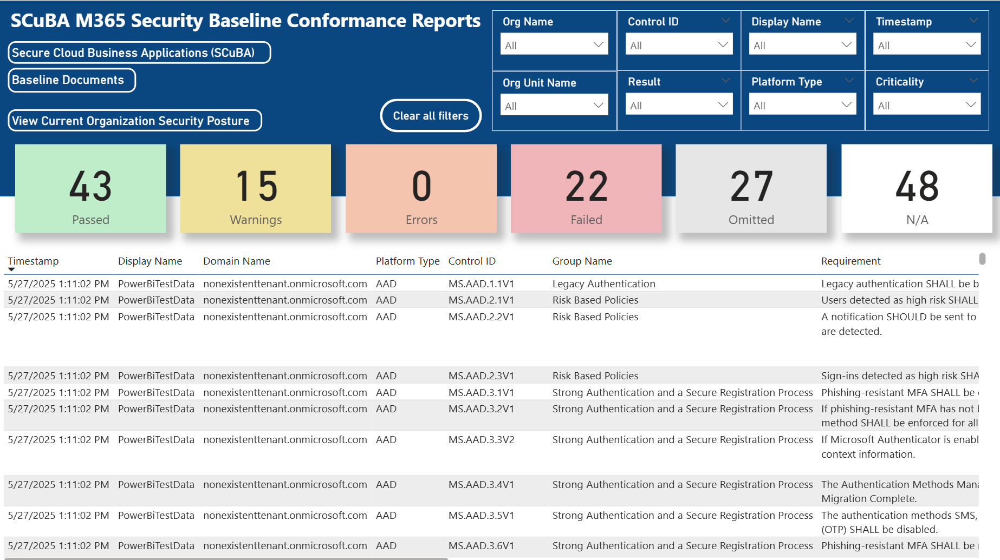

## **ScubaConnect PowerBI Integration Steps**

### Overview
The ScubaConnect PowerBI Report provides organizations with a comprehensive view of their Microsoft 365 data collected by the ScubaConnect tool. This report enables users to quickly identify trends, gaps, and actionable insights across their cloud environment, allowing continuous improvement of their security posture.

**Why use this report?**
- Gain centralized visibility into key security and compliance metrics.
- Easily track progress toward organizational security goals.
- Identify areas that require attention or remediation.
- Share insights with stakeholders through interactive dashboards.

### **Supported Scenarios**

This guide covers **two primary scenarios**:

1. **Automated Workspace Updates (Applicable to Commercial and GCC High)**
   - Configure PowerBI to use a Virtual Network Gateway to access data from the ScubaConnect storage account.

2. **Manual Workspace Updates (GCC)**
   - Use PowerBI Desktop to retrieve and publish data directly to a PowerBI workspace. If the report needs to be viewed by others this is the ideal option. If others don't need to view the report, see below.
   - You could also keep the data local and not publish to a PowerBI workspace.

> [!NOTE]
> **Automated updates (Scenario 1) is not available in GCC environments.** 
> It is supported only in Commercial and GCC High.
> [Limitations](https://learn.microsoft.com/en-us/data-integration/vnet/overview#limitations)

#### Feature Availability by Environment

| Step/Feature                | Commercial | GCC | GCC High |
|-----------------------------|:----------:|:---:|:--------:|
| Virtual Network Gateway     | ✅         | ❌  | ✅       |
| Automated Workspace Updates | ✅         | ❌  | ✅       |
| Manual Workspace Updates    | ✅         | ✅  | ✅       |

---

### **Pre-Requisites**
Ensure the following requirements are met before proceeding to avoid setup issues.

1. **Virtual Network Gateway Requirements**
   > **Note:** The Virtual Network Gateway option is only available in Commercial and GCC High environments. It is not supported in GCC.
   - [Register resource provider](https://learn.microsoft.com/en-us/data-integration/vnet/create-data-gateways#step-1-register-microsoftpowerplatform-as-a-resource-provider)
     - `Microsoft.PowerPlatform`
   - [Subnet delegation](https://learn.microsoft.com/en-us/data-integration/vnet/create-data-gateways#step-2-associate-the-subnet-to-microsoft-power-platform)
     - `Microsoft.PowerPlatform/vnetaccesslinks`
   - [License Requirements](https://learn.microsoft.com/en-us/data-integration/vnet/overview#limitations)
   - [PowerBI Desktop application](https://www.microsoft.com/en-us/download/details.aspx?id=58494&msockid=101dc2aa8ee969a80209d6378f076840)

2. **Requirements for GCC Environments**
   - [PowerBI Desktop application](https://www.microsoft.com/en-us/download/details.aspx?id=58494&msockid=101dc2aa8ee969a80209d6378f076840)

---

### **General Setup Steps**

1. **Download and Import the PowerBI Report**
   1. First, download the pre-built PowerBI report.
       - [Path to Download](https://github.com/cisagov/ScubaConnect/blob/main/m365/powerbi/SCuBA%20M365%20Report%20(Azure%20Blob%20Storage).pbix)
       > [!NOTE] The report has some example data loaded, however this will be overwritten when you update your data sources.
    2. Open Power BI Desktop, then select **File** > **Open** and choose the downloaded `.pbix` file.

2. **Modify the Data Sources**
   > [!IMPORTANT] If ScubaConnect was deplyed with a virtual network you will need to allow access.
   > [Allow Access](#gcc-environment-steps)
   1. In Power BI Desktop, go to the **Home** tab.
   2. Click **Transform data** > **Edit parameters**.
       - For **AzureBlob**, enter your Azure Blob Storage account name (e.g., `yourstorageaccount`).
         - You can enter either the storage name or FQDN, I.E (mystorage or https://mystorage.blob.core.windows.net)
       - For **Output-Directory**, enter the output directory name (default: `scubaconnect-output`).
       - Click **OK**.
   3. Click **Apply changes**, there will be a banner at the top of the report.
   4. Go to **Transform data** > **Data source settings**.
      - Select your data source and click **Edit Permissions**.
      - Under **Credentials**, click **Edit**.
        - Choose **Account key** (found in your Azure portal under **Security + Networking** > **Access Keys**).
        - Set Privacy level to **Organizational**.
      - Click **Save**.
   5. Click **Refresh** (next to **Transform data**) to verify the report updates with your data.

3. **Create a PowerBI Workspace** (Web based)
   1. Log in to the appropriate Power BI portal for your environment.
        - Commercial: https://app.powerbi.com
        - GCC: https://app.powerbigov.us
        - GCC High: https://app.high.powerbigov.us
   2. In the left menu, select **Workspaces** > **New workspace**.
   3. Name the workspace **ScubaConnect** and select **Save**.

4. **Publish the Report** (Desktop App)
   > Publishing uploads your report to the Power BI service so it can be shared.
   1. In the PowerBI desktop application, select the **Home** tab, select **Publish**.
   2. Select **Save** if prompted.
   3. Select **ScubaConnect** as the destination, then select **Select**.
   4. Use the provided hyperlink to view the report in the workspace.

5. **Follow on steps**
   1. Depending on your environment, follow the next steps to complete setup.
      - If you are in a **GCC High or Commercial** environment, continue to [Virtual Network Gateway Setup (Commercial & GCCHigh)](#virtual-network-gateway-setup-commercial--gcchigh).
      - If you are in a **GCC** environment, continue to [GCC Environment Steps](#gcc-environment-steps).

---

### **Virtual Network Gateway Setup (Commercial & GCCHigh)**

Follow the [General Setup Steps](#general-setup-steps) above, then:

> [!IMPORTANT]
> Ensure that you have reviewed and completed the pre-requisites before creating the gateway.

1. [Create a VNet data gateway](https://learn.microsoft.com/en-us/data-integration/vnet/create-data-gateways#step-3-create-a-vnet-data-gateway)

2. **Enable the Newly Created Gateway under Semantic Models Settings**
   - From your workspace, select the appropriate Semantic model and select the **...** then **Settings**.
     - Expand **Gateway and cloud connections**.
     - Enable the gateway by toggling the radio button under **Use an On-premises or VNet data gateway**.
     - Where you see **maps to**, select **Add to VNet**.
     - Create a new virtual network connection:
       - **Connection Name:** `ScubaConnect_Gateway`
       - **Connection type:** `Azure Blob Storage`
       - **Account:** `StorageAccountName`
       - **Domain:** `blob.core.windows.net`
       - **Authentication Method:** `oauth`
       - **Privacy Level:** `Organizational`
       > **Note:** If OAuth does not work as the authentication method, select **key** and enter the key from your storage account.
   - From your workspace, select the appropriate Semantic model and select the **...** then **Settings**.
     - Select the hyperlink labeled **View semantic model**.
     - Under **Lineage**, select **Open workspace Lineage**.
     - Select your **Azure Blob Storage** and verify that the connection status states **Connection successful**.

3. **Create a Refresh Schedule**
   - Select the **...** for Semantic model then **Settings**.
     - Expand **Refresh** and enable **Configure a refresh schedule**.
     - Set to the default (daily) or adjust as needed.
     - Select **Apply**.

---

### **GCC Environment Steps**

Follow the [General Setup Steps](#general-setup-steps) above.

> [!NOTE]
> The following steps are only required if ScubaConnect was deployed with a **Virtual Network**.

1. Ensure your PowerBI Desktop system's IP Address is allowed in the Storage Account network rules.
     - [Steps to Add IP](https://learn.microsoft.com/en-us/azure/storage/common/storage-network-security?tabs=azure-portal#managing-ip-network-rules)
2. Follow on tasks.
   - When using a virtual network, you will need to do a manual refresh of the report everytime you want to update the report in the Power BI workspace.
     - From the Power BI desktop add select **Home** then  **Refresh**.
   - If you're not using a virtual network with ScubaConnect, you can create a refresh scedule in the Power BI admin portal or manual refresh if preferred. [Create a Refresh Schedule](https://learn.microsoft.com/en-us/power-bi/connect-data/refresh-scheduled-refresh#scheduled-refresh)

---
